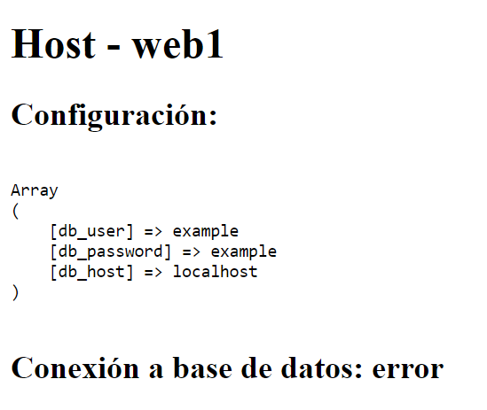
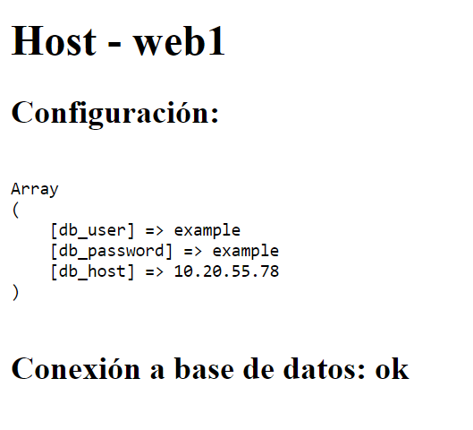

# Laboratorio - Introducción a Ansible

Ansible es una herramienta de automatización que permite la configuración
y administración de infraestructura. Un caso de uso de la herramienta es indicar
de forma declarativa (esto es indicar el estado deseado) de las aplicaciones que
deben estar instaladas en un servidor, esto a través de archivos fáciles de leer
escritos en formato YAML lo que la agrega al conjunto de herramientas de 
infraestructura como código (IaC). 

También es posible configurar multiples servidores con una sola configuración y 
nos permite manejar la configuración de estos servidores; diferenciar por 
ejemplo servidores web de base de datos, o servidores de pruebas de los de 
producción. 

Ansible es un producto de RedHat (adquirido en 2015) y es un proyecto de código
abierto que puede ser utilizado de forma gratuita. Sin embargo, Ansible también
cuenta con soporte comercial y un producto llamado Ansible Tower que permite
centralizar la información de los despliegues realizados por la plataforma.

## Prerequisitos

* Mac OS/Linux/Windows con Virtualbox y su extension pack instalado
* Bash o PowerShell
* [Vagrant](https://www.vagrantup.com/)

## Práctica

Para la práctica se utilizará una definición de máquinas virtuales implementadas
en un archivo de configuración de Vagrant. Puedes realizar el 
[laboratorio introductorio a Vagrant](https://javiertoledos.github.io/lab-vagrant/)
para aprender un poco sobre este primero. 

Para este laboratorio descarga y descomprime el contenido de [este repositorio](https://github.com/javiertoledos/lab-ansible/archive/master.zip). 
La estructura del laboratorio se plantea de la siguiente manera:

```
|  Vagrantfile
|  playbook.yml
└───provisioning
    ├───files
    │   └───app
    ├───roles
    │   ├───nginx
    │   │   ├───handlers
    │   │   └───tasks
    │   ├───nginx-site
    │   │   ├───defaults
    │   │   ├───tasks
    │   │   └───templates
    │   └───php
    │       └───tasks
    └───templates
```

El archivo Vagrantfile define una máquina virtual que se denominará como 
servidor web1 y la cual se provisiona utilizando un [Playbook](https://docs.ansible.com/ansible/latest/user_guide/playbooks_intro.html) 
(playbook.yml) de Ansible. Un Playbook es básicamente un conjunto de archivos
YAML que definen el estado y configuración deseados para configurar una máquina.

Los playbooks pueden estar dividios en tareas y roles. Las tareas son las 
definiciones de lo que se requiere realizar en una máquina, por ejemplo copiar
un archivo, aplicar una plantilla con variables como un archivo de configuración 
o definir servicios a instalar utilizando el gestor de paquetes del sistema 
operativo. Los roles son "submódulos" que permiten permiten reutilizar tareas
y configuraciones con otros usuarios de la herramienta.

Este Playbook contiene 3 roles:
 * nginx - Instala y configura nginx
 * php-nginx - Instala y configura PHP para su uso con nginx
 * nginx-site - Configura un virtualhost en nginx

### Iniciando el proyecto

Provisiona la máquina virtual del laboratorio ejecutando

```
vagrant up
```

Esto iniciará una máquina virtual en Virtual Box con Ubuntu 18.04 y acto seguido
utilizará Ansible para provisionar la máquina. Una nota importante es que 
utilizará el mecanismo de `ansible_local`. Esta decision responde a que la 
herramienta de Ansible solo está disponible para Linux y Mac, en el caso de los
usuarios Windows para poder probar la herramienta, esta debe ejecutarse sobre la
misma máquina virtual iniciada por Vagrant. En un entorno de producción es 
probable que Ansible esté ejecutandose en una máquina distinta a las que se 
configuran (provisionan) siendo agentless, es decir, no necesita que sea 
instalado en los equipos destino.

Una vez ejecutado, deberá apreciarse un output similar a este: 

```
PLAY [webservers] **************************************************************

ok: [web1]

TASK [nginx : Install Nginx] ***************************************************
changed: [web1]
[WARNING]: Updating cache and auto-installing missing dependency: python-apt

TASK [php-nginx : Install PHP] *************************************************
changed: [web1]

TASK [php-nginx : Create a PHP upstream for NGINX] *****************************
changed: [web1]

TASK [nginx-site : Remove default site] ****************************************
changed: [web1]

TASK [nginx-site : Create nginx site configuration] ****************************
changed: [web1]

TASK [nginx-site : Enable nginx site] ******************************************
changed: [web1]

TASK [Copy app into server] ****************************************************
changed: [web1]

TASK [Create nginx site configuration] *****************************************
changed: [web1]

RUNNING HANDLER [restart nginx] ************************************************
changed: [web1]

PLAY RECAP *********************************************************************
web1: ok=10   changed=9    unreachable=0    failed=0    skipped=0    rescued=0    ignored=0
```

Esto indica que se ejecutaron las distintas tareas y roles del playbook para 
instalar nuestra aplicación de PHP en la máquina virtual. 

La configuración con la que viene la aplicación deberá levantar una máquina 
virtual con un servidor web que se puede visitar en http://localhost:8081. 
Si todo se ejecutó correctamente, deberá verse lo siguiente al visitar la url:



### Agregando un nuevo servidor

Agrega un nuevo servidor web incluyendo estas líneas dentro de la configuración 
actual: 

```ruby
  # Reemplaza la configuración del servidor web1 para incluir multiples servers
  (1..2).each do |i|
    config.vm.define "web#{i}" do |webserver|
      webserver.vm.box = "hashicorp/bionic64"
      webserver.vm.hostname = "web#{i}"
      webserver.vm.network "forwarded_port",
        guest: 80,
        host: 8080 + i,
        host_ip: "127.0.0.1"
    end
  end
```

Para que ansible provisione este servidor como parte de los webservers modifica
la línea de código de provisionamiento para que provisione también el server 
`web2`:

```ruby
    #...
    ansible_local.groups = {
      "webservers" => ["web1", "web2"]
    }
```

Levanta el nuevo servidor y ejecuta el provisionamiento con el comando

```
vagrant up --provision
```

Luego de esto deberías ser capaz de visitar el mismo sitio anterior en la 
dirección http://localhost:8081 y el nuevo sitio en el puerto que le sucede en 
http://localhost:8082.

Ansible utiliza un archivo de inventario que permite definir cuales son los 
hosts a los que debe conectarse (vía ssh). Este inventario puede definirse como
un archivo yaml que luce similar a este (no es necesario colocarlo en el 
laboratorio):

```yaml
all:
  hosts:
    mail.example.com:
  children:
    webservers:
      hosts:
        web1.example.com:
        web2.example.com:
    dbservers:
      hosts:
        db.example.com:
```

En nuestro caso, Vagrant maneja esta configuración y ejecuta por detrás el
comando de Ansible para provisionar usando un archivo de inventario generado 
automáticamente por Vagrant (cuando uses Ansible sin Vagrant deberas tomar en
cuenta que esto lo debes hacer por tu cuenta). En la configuración del 
Vagrantfile se puede apreciar como se definió un grupo de servidores llamado
`webservers` que permite asociar las máquinas locales creadas a la configuración
específica para ellas definida en el archivo `provisioning/playbook.yml`.

## Ejercicio

1. Modifica la versión de Ubuntu utilizada en las máquinas de 18.04 a 20.04.
    * En ubuntu 20.04 puede que la versión de PHP que se pueda instalar sea la 
    versión 7.4 en vez de la 7.2. Asegurate de cambiar la variable relacionada 
    en el archivo de `playbook.yml` para que tenga éxito la instalación de PHP.
2. Agrega una nueva máquina virtual que sea una base de datos y provisionala con
   mysql. A continuación hay algunos consejos que puedes tomar en cuenta:
    * Existe un repositorio de roles ya creados para Ansible llamado 
    *Ansible Galaxy*, en él puedes encontrar roles que ya instalan Mysql. Revisa
    la documentación de Vagrant y la de Ansible Galaxy para especificar el 
    archivo donde se definen estas dependencias y el folder donde se instalarán.
    * Para diferenciar entre los webservers y la base de datos, la recomendación
    es crear un nuevo grupo en la configuración de ansible. Para cada grupo de
    servidores puedes configurar sus propias variables, asegurate que para el 
    servidor de base de datos, coloques las variables que necesita para que se
    pueda crear el usuario y contraseña correctos para conectarse. Un buen lugar
    para buscar como configurar un rol de Ansible es buscando el archivo de 
    valores por defecto en `<carpeta-del-rol>/defaults/main.yml`.
    * Para conectar las máquinas virtuales entre ellas, deberás agregar una 
    segunda interfase de red que sea de tipo privado (preferible) o bridge.
    * Deberás configurar las variables adecuadamente  en el archivo de 
    `playbook.yml` para que la app de php pueda conectarse al servidor de base 
    de datos de MySQL. 
    * Si la comunicación tiene éxito podrás ver el siguiente mensaje al visitar
      los web servers con alguna de las urls anteriores:
        
3. Crea un archivo `respuestas.txt` y responde las siguientes preguntas:
    * Investiga en términos de devops cuál es la diferencia entre el paradigma
      declarativo e imperativo y describe que ventajas tiene utilizar una 
      herramienta como Ansible en vez de utilizar scripts de shell o hacerlo 
      manualmente.
    * En los roles incluidos en este proyecto se utilizó una tarea que installa 
      las dependencias utilizando aptitude (apt-get). Investiga que otros 
      gestores de paquetes hay en las diferentes distribuciones de Linux.
5. Crea un archivo zip con el nombre `lab-ansible-<numero de carne>.zip`. Es
  requerido respetar este nombre ya que se evaluará con una herramienta
  automática el laboratorio y en caso de no seguir instrucciones, no se evaluará
  la respuesta.
6. En el archivo zip se debe colocar el contenido modificado que se descargó al
  inicio de la práctica. Los archivos y folders que se deben incluir son:
    - Vagrantfile
    - provisioning
    - respuestas.txt

    Archivos y folders a excluir:
    - .vagrant
    - README.MD
    - images

    Es importante que el archivo .zip tenga la misma estructura de directorios y
    el laboratorio no esté dentro de un folder en el archivo zip:

    **Correcto:**
    ```
    lab-vagrant-20072089.zip
    ├── Vagrantfile
    ├── respuestas.txt
    └── provisioning
    ```
    **Incorrecto:**
    ```
    laboratorio.zip
    └──master
        ├── .vagrant
        ├── images
        ├── Vagrantfile
        ├── respuestas.txt
        └── provisioning
    ```

